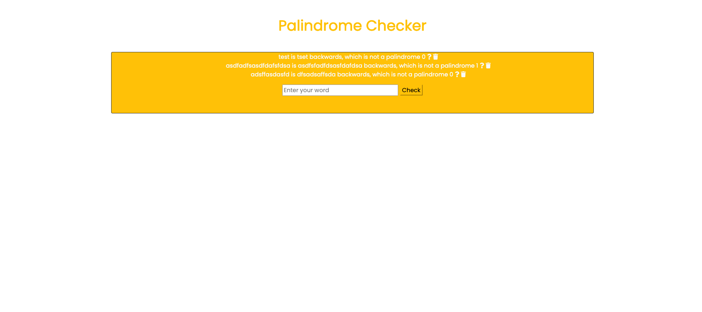

# My Awesome Project
This project is to use express with a previous project. Users can enter in a word and check to see if the word is a palindrome. There is an icon with a question mark that increments by one for questions. There is also a trashcan icon to delete user inputs. 

**Link to project:**

## How It's Made:

**Tech used:** HTML, CSS, JavaScript, nodeJS, Express, mongoDB

This project is for working with CRUD application Express. When a user enter text in the input and presses submit this will trigger a get request. 

READ
-the get request reads and renders our main index page using EJS as our view engine. It provide the entire database collection to the response object and renders our main page view onto the DOM.

POST
-the post request will save the user input into a database and trigger another get request.

PUT
-the put request will run when the icons are clicked. event listeners trigger a function that submit a fetch request to our declared routes for put requests. the routes use mongo provided functions findone and update to modify the dom and returns a response to our function in the main.js folder. The promise in our fetch triggers a page reload.   

DELETE
-the delete request deletes the user input from  our database, returns a response to our function in our main.js folder, and the promise in our fetch triggers a page reload.  

## Optimizations

## Lessons Learned:

A great takeaway from this project is understanding of read, write, update and delete to manipulate the javascript dom using ejs and our view engine.

## Examples:

